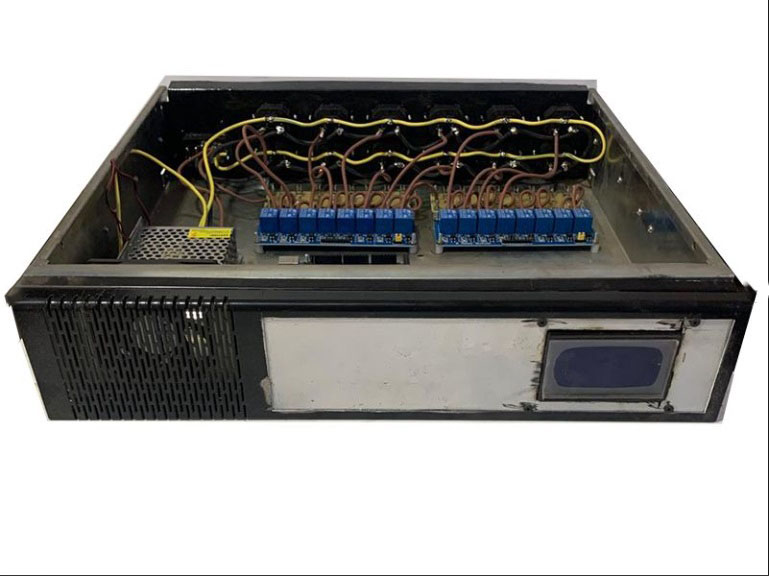
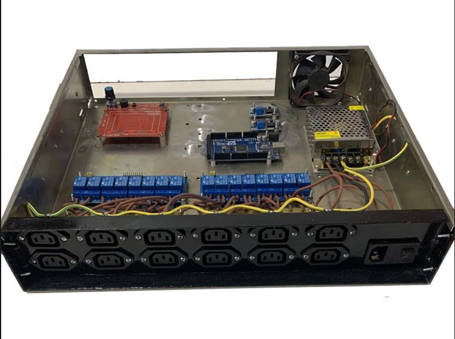
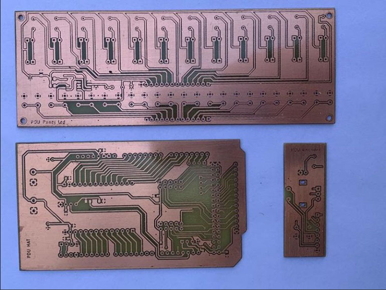
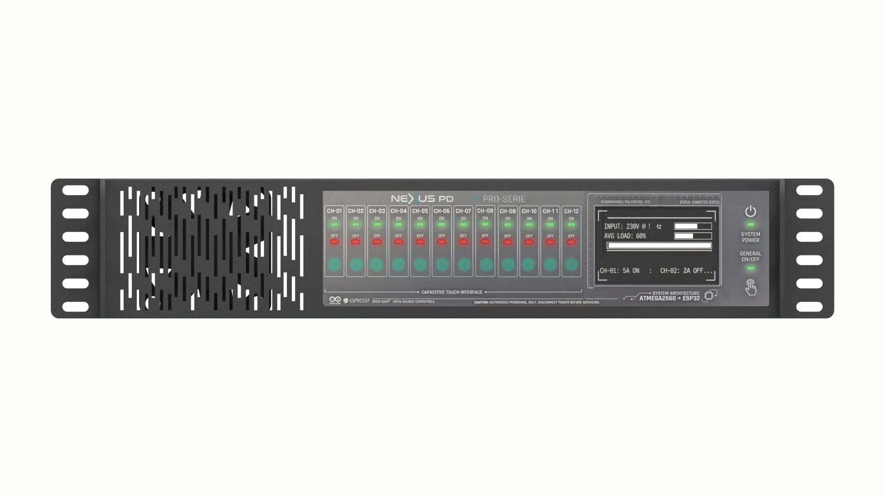

# open-pdu-wifi
Open-source Wi-Fi controlled programmable PDU (DIY), designed for modular hardware, repairability, and real-world engineering constraints.
This project is developed in Spanish, as it is being carried out in Argentina. 🇦🇷
# PDU Programable DIY – Proyecto en Desarrollo

Este repositorio documenta el desarrollo de una **PDU programable DIY** orientada a racks, laboratorios, homelabs y entornos técnicos, diseñada bajo un enfoque práctico, modular y realista, priorizando criterio de ingeniería por sobre soluciones comerciales cerradas o costosas.

El proyecto nace como respuesta a la falta de PDUs programables accesibles para entornos no corporativos, manteniendo capacidades avanzadas de control, monitoreo y expansión.

---

## 🧠 Objetivo del proyecto

Diseñar y construir una **PDU programable en formato rack 2U**, con control local y remoto, medición individual de consumo y capacidad de expansión futura, utilizando hardware accesible y fácilmente mantenible.
* NOTA: Gabinete seleccionado al efecto Numata desarmable 2U con soportes para rack
---

## 🔧 Características principales (diseño)

- 12 salidas de energía controlables individualmente  
- 4 relés auxiliares reservados para eventos o funciones futuras  
- Medición de corriente individual por canal (sensores de efecto Hall)  
- Control local mediante botones y LEDs de estado  
- Interfaz local mediante display Reprap 12864 + encoder  
- Gestión remota vía Wi-Fi (ESP8266)  
- RTC dedicado para eventos temporizados  
- Watchdog por sobre-tensión  
- Arquitectura modular y reparable  
- Pensado para montaje en rack estándar 2U  

---

## 🧩 Arquitectura de hardware

El sistema se basa en una arquitectura distribuida y modular:

- **Arduino Mega** como controlador principal
- **ESP8266** para conectividad Wi-Fi y gestión remota
- **RTC DS3231** para temporización independiente
- **HAT dedicado para Arduino Mega**
- **Baseboard para ESP8266 + RTC**
- **Módulo independiente de encoder**
- **Módulos de relé 220V con fusible**
- **Fuentes step-down dedicadas**
- **Distribución de energía protegida por fusibles**
- **Ventilación activa para la fuente principal de 12V**

La separación en placas permite:
- facilitar el armado
- simplificar reparaciones
- habilitar futuras revisiones sin rediseño completo

---

## 📦 Estado actual del proyecto

🔧 **Fase actual:**  
- Diseño de hardware finalizado  
- PCB fabricados y en mano  
- Estructura mecánica definida  
- Montaje en rack 2U en progreso  

🛠️ **En curso:**  
- Ensamblaje de placas  
- Cableado interno  
- Definición de arquitectura de firmware  

💻 **Pendiente:**  
- Desarrollo de firmware Arduino / ESP8266  
- Montaje de frente control manual
- Pruebas funcionales completas  

---

## 📸 Imágenes

Este repositorio incluye imágenes reales del estado actual del proyecto:
- Rack armado y estructura 2U  
- Interior del equipo (arquitectura general)  
- Frente del equipo (sin perforar, en fase de diseño estético)  
- PCB reales fabricados  

---

## 📜 Licenciamiento (planificado)

La intención del proyecto es liberar:

- **Firmware** bajo una licencia GNU open-source (a definir según dependencias)
- **Hardware (esquemáticos y PCB)** bajo una licencia de hardware abierto
- **Documentación** bajo licencia libre

Las licencias definitivas se establecerán una vez consolidado el diseño y cerrado el flujo de software.

---

## 🚧 Nota importante

Este repositorio se utiliza actualmente como **documentación viva del proceso de desarrollo**.  
No se recomienda replicar el diseño hasta la publicación de la versión estable.

---

## 🤝 Colaboraciones y feedback

El proyecto se comparte con el objetivo de:
- documentar decisiones técnicas reales
- recibir feedback constructivo
- conectar con otros desarrolladores de hardware e infraestructura

Toda observación técnica es bienvenida.

---

## 📍 Autor

Proyecto personal desarrollado en Argentina, bajo restricciones reales de costos, disponibilidad y fabricación, priorizando soluciones prácticas y mantenibles.

ALGUNAS IMAGENES:

  
   
  <em>Vista frontal del rack</em>

  
   
  <em>Vista trasera del rack</em>

  
   
  <em>HAT para Arduino Mega, Baseboard ESP8266 + RTC y módulo encoder</em>

  
   
  <em>Posible diseño del frente del PDU</em>

